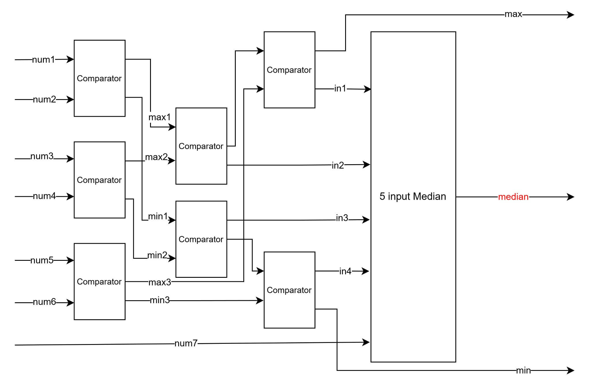

# HW1: 7-Input Median Finder

Find the median value from seven 4-bit input numbers.

## Specifications
- **Input**: 7 × 4-bit unsigned numbers
- **Output**: 4-bit median value

## Block Diagram

## Design Approach
1. Use 3 comparators to compare input pairs (`num1-num2`, `num3-num4`, `num5-num6`) → get `min1/max1`, `min2/max2`, `min3/max3`
2. Filter out the maximum from `max1/max2/max3` and minimum from `min1/min2/min3`
3. Pass remaining 4 values and `num7` to `MedianFinder_5num` to get median

## Module Structure

- `Comparator2.v` - 2-input min/max comparator
- `MedianFinder_3num.v` - 3-input median finder
- `MedianFinder_5num.v` - 5-input median finder  
- `MedianFinder_7num.v` - 7-input median finder (top module)
