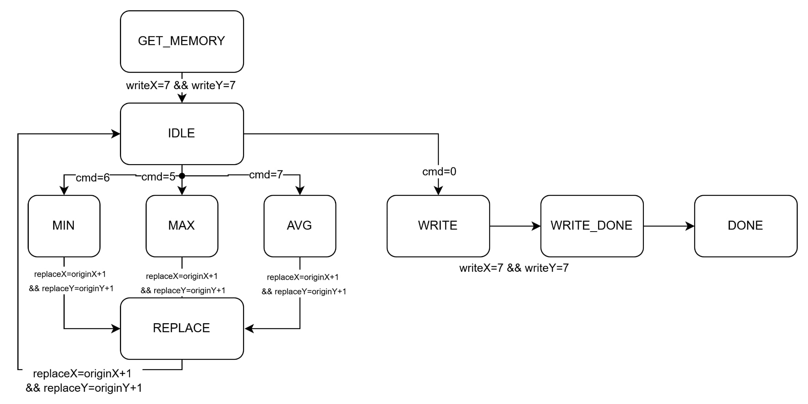

# HW2: LCD Controller

A state machine-based controller that processes LCD display data with shift and filter operations.

## Specifications

- **Memory**: 8×8 array (64 pixels)
- **Commands**: 
  - 0: Write back
  - 1-4: Shift operations
  - 5: Maximum filter
  - 6: Minimum filter
  - 7: Average filter
- **Filter Window**: 4×4 (16 values)

## Block Diagram

## Design Approach

1. **GET_MEMORY**: Copy data from RAM to `temp_memory` (8×8 array)
2. **IDLE**: Wait for commands and process:
   - **cmd = 1/2/3/4**: Shift operations (up/down/left/right) → move `origin_x`/`origin_y`, stay in IDLE
   - **cmd = 5/6/7**: Filter operations (max/min/average) → go to REPLACE state
   - **cmd = 0**: Write back → transfer to WRITE state
3. **REPLACE**: Examine 16 values around origin point (4×4 window), compute replacement value, update `temp_memory`
4. **WRITE**: Write `temp_memory` back to RAM and finish

## Module Structure

- `LCD_CTRL.v` - Main controller with FSM, memory management, and operation logic

