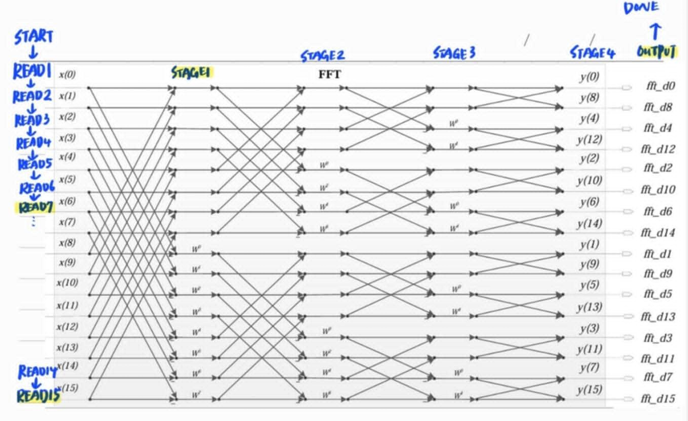
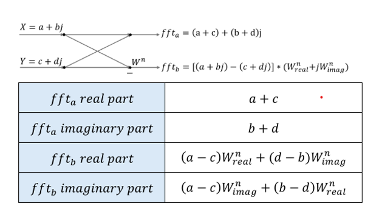

# HW3: 16-Point FFT (Fast Fourier Transform)

A pipelined 16-point FFT processor that computes real and imaginary outputs using 4-stage butterfly operations.

## Specifications

- **Input**: 16-point real data stream (16-bit each)
- **Output**: 16-point complex data (real + imaginary, 16-bit each)
- **Stages**: 4-stage radix-2 FFT

## Block Diagram

## FFT Architecture

## Design Approach

### State Flow
1. **START** → Initialize
2. **READ1-READ15**: Read 16 inputs sequentially (`x0` to `x15`)
3. **STAGE1-STAGE4**: Four stages of FFT butterfly computation using 8 units
4. **OUTPUT**: Output real and imaginary parts (2 cycles per output)
   - Check `fir_valid`:
     - If `1`: Continue to **READ6** (pipeline next data)
     - If `0`: Go to **DONE**
5. **DONE**: Finish

### Pipeline Operation
- During STAGE1-4 and OUTPUT states, continuously check `fir_valid`
- If valid, read new inputs into `x0-x15` registers
- After OUTPUT ends, `x4` is already loaded → jump to READ6 state

### FFT Computation
- Uses **8 butterfly units** arranged in 4 stages according to the FFT dataflow diagram
- Each stage performs complex multiplication and addition

## Module Structure

- `FFT.v` - Main FFT module with FSM and data control
- `Unit.v` - Butterfly computation unit