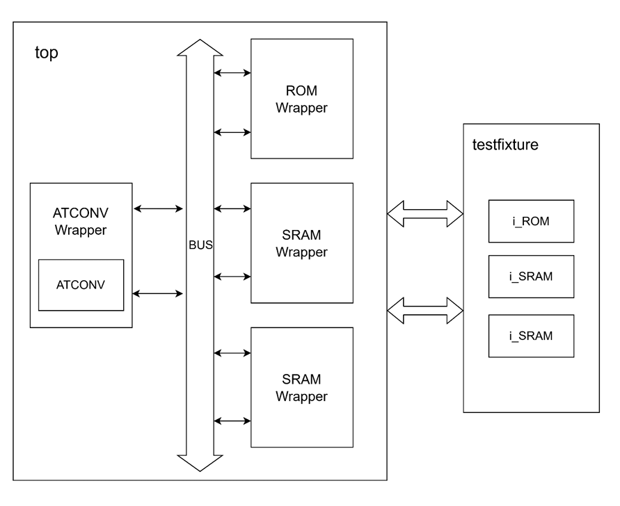
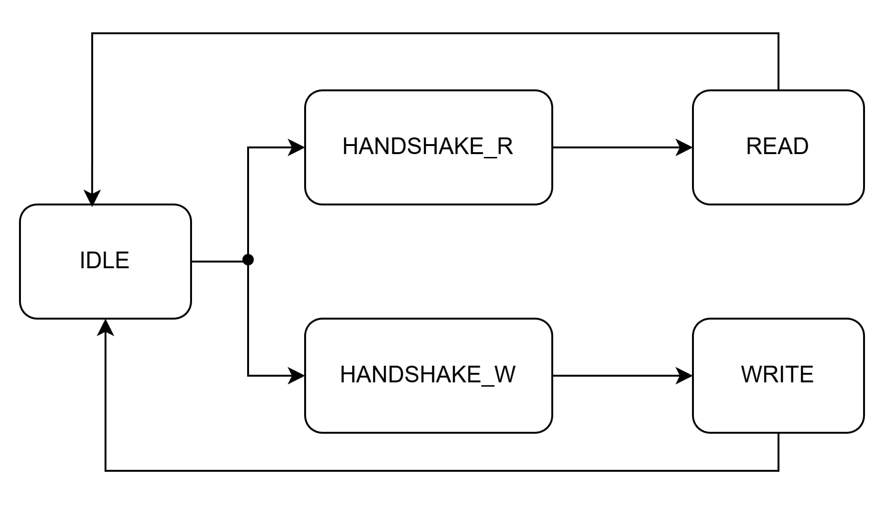

# HW4: ATCONV - Convolution and Pooling System

A two-part CNN accelerator implementing convolution and max pooling operations with handshake protocol and memory management.

## Specifications

- **Kernel**: 3×3 convolution kernel (fixed weights)
- **Layer0**: Post-convolution feature map
- **Layer1**: Post-pooling output
- **Pooling**: 2×2 max pooling with stride 2
- **Protocol**: Valid-Ready handshake for data transfer

## Part 1: ATCONV Module

### Convolution Layer
- Traverse the image left-to-right, top-to-bottom using position pointer (`pos`)
- For each position, perform convolution in **9 cycles**:
  - Each cycle: fetch one pixel and multiply with corresponding kernel weight
  - Accumulate results and store into `layer0` memory

### Max Pooling Layer  
- Traverse `layer0` left-to-right, top-to-bottom with stride of 2
- For each position, read **4 cycles** to fetch 2×2 window from `layer0`
- Keep the maximum value among 4 pixels
- Store result into `layer1` memory

## Part 2: System Integration

### Block Diagram

### State Diagram

### Handshake Protocol
- **Before data transfer**: Enter WAIT state
  - Cycle 1: Assert `VALID` and wait for `READY`
  - When `READY` received: De-assert `VALID`
  - Next cycle: Begin data transfer

### Memory Controller
- **IDLE**: Wait for memory request
- **Read Path**:
  - Receive `RVALID` → Enter `HANDSHAKE_READ` state
  - Assert `READ_READY` 
  - Next cycle: Begin reading data
- **Write Path**:
  - Similar handshake mechanism for write operations

## Module Structure

### ATCONV Module
- `ATCONV.v` - Main convolution and pooling processor

### System Module  
- `ATCONV_Wrapper.v` - Wrapper for ATCONV with handshake interface
- `BUS.v` - Bus controller for memory arbitration
- `ROM_Wrapper.v` - ROM interface with handshake
- `SRAM_Wrapper.v` - SRAM interface with handshake
