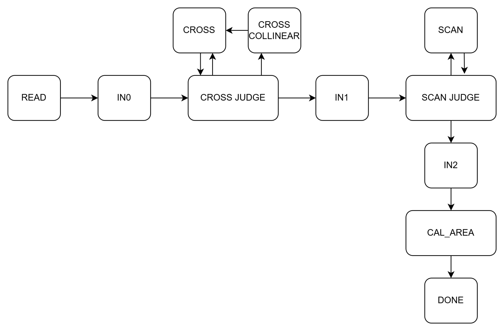

# HW5: MCH - Minimum Convex Hull

A hardware implementation of Graham Scan algorithm to compute the convex hull of 20 input points and calculate the enclosed area.

## Specifications

- **Input**: 20 points with 8-bit X and Y coordinates
- **Output**: 17-bit area value
- **Algorithm**: Graham Scan (angular sort + stack-based scan)

## State Diagram

## Design Approach

### Phase 1: Read and Identify Anchor
1. **READ**: Read 20 input points while identifying the leftmost-bottom point as anchor
   - Anchor stored at array position 0, others fill sequentially

### Phase 2: Angular Sorting
2. **INIT0 (IN0)**: Load first vertices for cross product calculation
3. **CROSS_JUDGE**: Determine swap based on cross product sign (insertion sort by polar angle)
   - If cross product = 0: Points are collinear → enter **CROSS_COLLINEAR**
4. **CROSS_COLLINEAR**: For collinear points, compare distances from anchor (farther point sorted later)
5. **CROSS**: Continue loading vertices and computing cross products

### Phase 3: Graham Scan
6. **INIT1 (IN1)**: Load first vertices for left turn detection
7. **SCAN_JUDGE**: Check if three points form left turn
   - **Left turn**: Push onto stack
   - **Not left turn**: Pop from stack until left turn forms
8. **SCAN**: Continue loading vertices for scan

### Phase 4: Area Calculation
9. **INIT2 (IN2)**: Load first vertices for area computation
10. **CALC_AREA (CAL)**: Compute area using Shoelace formula while accumulating results
    - Formula: Area = ½|Σ(x_i × y_(i+1) - x_(i+1) × y_i)|
11. **PREPARE_OUTPUT**: Finalize computation
12. **DONE**: Output area and return to READ

## Module Structure

- `MCH.v` - Main module with FSM, sorting logic, stack management, and area calculation
